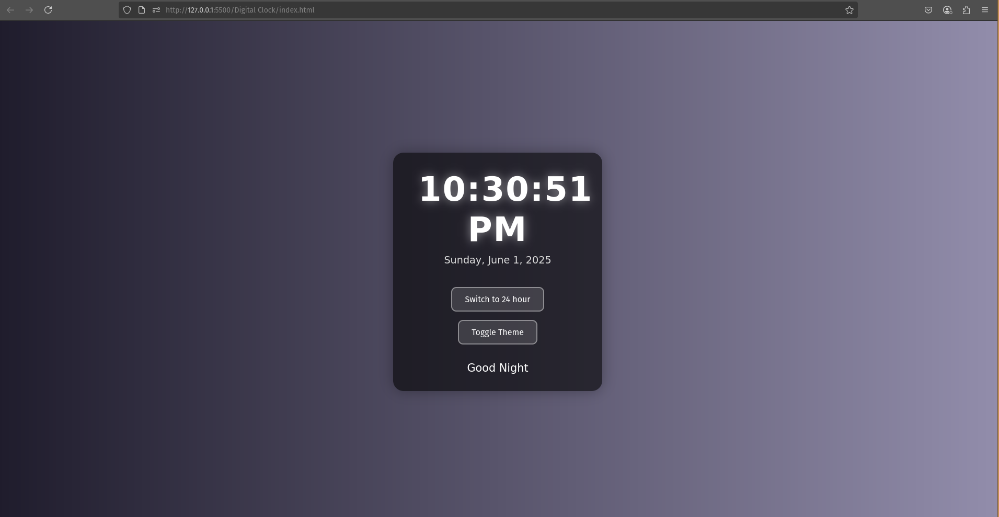
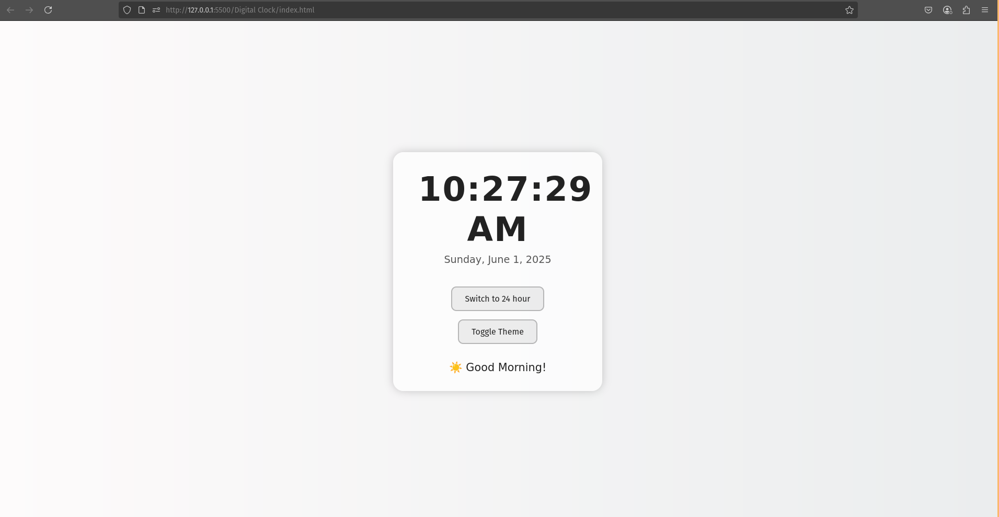

# ⏰ Digital Clock

📡 **Live Demo**: [https://digitalclock-psi.vercel.app](https://digitalclock-psi.vercel.app)

A beautifully styled, responsive digital clock web app that displays the current time, date, and a personalized greeting. It supports light/dark mode switching, 12/24-hour format toggle, and automatic theming based on time of day.

---
## 📂 Folder Structure

10 JS Projects/
│
├── Digital Clock/
│   ├── index.html
│   ├── script.js
│   ├── styles.css
│   ├── README.md
│   └── Screenshots/
│       ├── Darkmode.png
│       └── LightMode.png
│
└── README.md  ← Root README for all 10 JS projects

## 🚀 Features

### 🕒 Time Display
- Real-time clock updates every second.
- Toggle between **12-hour** and **24-hour** formats.
- Shows AM/PM in 12-hour format.

### 📅 Date Display
- Fully formatted date (e.g., "Saturday, June 1, 2025").
- Uses `toLocaleDateString()` with rich formatting options.

### 🌞🌚 Theme Switching
- Automatically switches to **light mode at 6 AM** and **dark mode at 7 PM**.
- Includes manual **theme override** via a toggle button.
- Smooth CSS transitions between themes.
- Manual toggle respects auto-theme rules unless explicitly reset.

### 👋 Dynamic Greetings
- Displays a greeting based on the current time:
  - `☀️ Good Morning!` (Before 12 PM)
  - `🌤️ Good Afternoon!` (12 PM–5 PM)
  - `🌙 Good Evening!` (5 PM–9 PM)
  - `Good Night` (After 9 PM)

### 🎨 UI/UX
- Animated time element with a subtle `pulse` effect.
- Responsive layout for mobile & desktop.
- Buttons styled with **glassmorphism**, hover/active effects, and blur.
- Theme-specific styles for both light and dark modes.

---

## 🧪 Technologies Used

| Layer | Tech |
|------|------|
| Markup | HTML5 |
| Styling | CSS3 (Flexbox, Animations, Media Queries) |
| Interactivity | Vanilla JavaScript (ES6+) |
| Time Manipulation | `Date` Object APIs |
| Responsive Design | Media Queries, Viewport Units |

---

## ✅ Modern Features & Best Practices

- ✅ `const`/`let` usage for block scope clarity.
- ✅ Separation of concerns: `HTML`, `CSS`, and `JS` are modularized.
- ✅ `padStart()` for consistent time formatting.
- ✅ `toLocaleDateString()` with i18n support.
- ✅ `setInterval` with `clearInterval` for efficient memory management.
- ✅ Manual vs Auto theme logic with user override detection.
- ✅ Semantic HTML (`<h1>`, `
`, `<button>`, etc.).

---

## 🧠 Strengths

- **Clean, readable, and maintainable codebase.**
- **Responsive design** that works well on mobile devices.
- **Customizability** in theme logic and time format.
- **Good UX**, with transitions, feedback, and greeting enhancements.
- **Respects user override** for theme toggling.
- **Efficient state control** via flags like `is24hour`, `userOverriddenTheme`, and `lastGreeting`.

---

## 💡 Future Improvements / Feature Ideas

| 🔧 To Add | 💬 Description |
|----------|----------------|
| 🌐 Timezone Support | Allow users to select and view time in different timezones. |
| 🖼️ Background Themes | Add background images that change with the time of day. |
| 🔈 Voice Greeting | Use Web Speech API to read out the current time or greeting. |
| ⏱️ Stopwatch/Timer | Add optional modules for a stopwatch or countdown timer. |
| 📦 LocalStorage | Persist time format and theme preferences across sessions. |
| 🌍 Language Support | Allow user to switch date formatting language manually. |
| ⏰ Alarm Feature | Let users set alarms or reminders. |
| 🧪 Testing | Add unit tests for clock/greeting logic (Jest or plain JS). |

---

## 🛠️ Areas for Enhancement

- ⌛ **Refactor clock interval logic** to start only once (avoid double `setInterval` calls).
- 🎨 **Accessibility**: Add ARIA labels and `role` attributes for better screen reader support.
- 🧹 **Extract inline `Date` calculations** into utility functions for readability.
- 📏 **Limit manual theme override duration** (e.g., reset override after a few hours).
- 🧪 **Use `requestAnimationFrame`** for smoother time updates (optional optimization).
- 🔍 **Add tooltip or title attributes** to buttons for better UX.

---

## 📸 Screenshot

**Dark Mode**

---
**Light Mode**

## 🧑‍💻 Author

**Saim Ahmed** – [Aspiring Software Engineer 🚀]  
_Crafted with ❤️ using vanilla JavaScript, CSS magic, and forward-thinking logic._

---

## 📜 License

This project is open-source and available under the **MIT License**.
