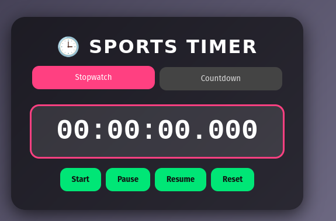
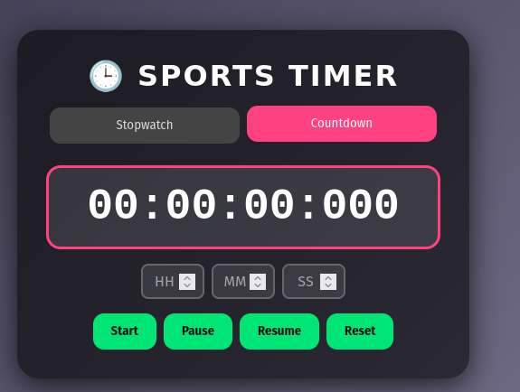

# 🕒 Sports Timer

A high-performance, responsive **Sports Timer** web application featuring both **Stopwatch** and **Countdown** modes. Built with vanilla HTML, CSS, and JavaScript, it uses `performance.now()` and `requestAnimationFrame()` for precise timing and smooth UI updates.

---

## 🌐 Live Demo

Experience the timer in action:
[https://digitalstopwatch-livid.vercel.app/](https://digitalstopwatch-livid.vercel.app/)

## 📂 Repository

Explore the source code:
[GitHub – Digital Stop Watch](https://github.com/Saimahmed78/10-Days-10-JS-Projects-Series/tree/7e0cfa2b1075b59220ddb7064d58ac2209302461/Digital%20Stop%20Watch)

---

## 📁 Project Structure

```text
10 JS Projects/
└── Digital Stop Watch/
    ├── assets/
    │   └── screenshots/
    │       ├── countdown timer.png
    │       └── Stopwatch.png
    └── src/
        ├── index.html
        ├── style.css
        └── index.js
```

## 📸 Screenshots & Demo Video

Below are placeholders for app screenshots and a demo video. Replace the paths with your actual assets:


_Stopwatch mode interface_


_Countdown Timer mode interface_

🎥 **Demo Video**


> **Note**: GitHub README preview does not support direct HTML `<video>` embedding. Please use the link below to access the demo video.

[▶️ Watch the demo video](assets/video.mp4)

---

## 🚀 Features

- **Dual Modes**: Seamlessly switch between stopwatch and countdown.
- **Millisecond Precision**: Time calculations leverage `performance.now()`.
- **Smooth Animations**: UI updates synchronized with display refresh via `requestAnimationFrame()`.
- **Input Validation**: Real-time clamping of hours (0–24), minutes and seconds (0–59).
- **Full Controls**: Start, Pause, Resume, Reset in both modes.
- **Completion Animation**: Celebratory visual effects on countdown completion.
- **Responsive Design**: Optimized layout for mobile and desktop screens.

---

## 💪 Strengths

- **Performance-Optimized**: Efficient rendering loop, minimal CPU usage.
- **No Dependencies**: Vanilla implementation, zero external libraries.
- **Modular Code**: Clear separation of concerns, easy to extend.
- **User-Friendly**: Intuitive interface with immediate validation feedback.

---

## ⚠️ Weaknesses

- **Audio Alerts Missing**: No built-in sound/vibration notifications.
- **Accessibility**: Lacks ARIA attributes and keyboard shortcuts.
- **No Persistence**: Timer state resets on page reload.
- **Customizability**: Hardcoded time ranges and animation parameters.

---

## 🔮 Future Enhancements

- **Audio & Haptic Feedback**: Integrate sounds and vibration on completion.
- **Lap/Split Functionality**: Add lap recording for stopwatch mode.
- **Theme Toggle**: Dark/light mode with user preference saved.
- **State Persistence**: Store timer progress in `localStorage` for continuity.
- **Enhanced Accessibility**: ARIA roles, focus management, and keyboard controls.
- **Progress Visuals**: Circular or linear progress bars for countdown.

---

## 🛠️ Setup & Installation

1. **Clone the repository**

   ```bash
   git clone https://github.com/Saimahmed78/10-Days-10-JS-Projects-Series.git
   ```

2. **Navigate to the project folder**

   ```bash
   cd "10 JS Projects/Digital Stop Watch/src"
   ```

3. **Open in your browser**

   - Double-click `index.html` or serve via a local HTTP server:

     ```bash
     npx http-server .
     ```

4. **Enjoy the timer!**

---

## 🙏 Acknowledgements

Built as part of the **10 JS Projects Series** by Saim Ahmed.

---

© 2025 Saim Ahmed. All rights reserved. Contribute, fork, and share your enhancements!


