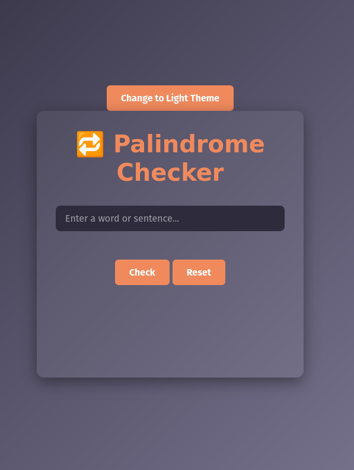

# Palindrome Checker 🚀

## 1. Title

**Palindrome Checker**

## 2. Description

A lightweight, responsive web app that checks whether a given word or sentence is a palindrome. Users can toggle between dark and light themes, reset the input, and receive immediate feedback via dynamic result messages.

## 3. Features

- **Palindrome Validation**: Strips non-alphanumeric characters, normalizes case, and tests for palindromicity.
- **Theme Toggle**: Dark/light mode switch driven by CSS variables (`--bg-color`, `--text-color`, etc.).
- **Responsive Design**: Mobile-first layout with media queries for screens down to 320px.
- **Enter-Key Support**: Press “Enter” in the text input to trigger the check.
- **Reset Functionality**: Clear input and result with a single click.
- **Dynamic Styling**: Success and error messages use theme-aware CSS variables (`--success-color`, `--error-color`).
- **Input Validation**: Highlights the input border in amber when empty.

## 4. Concepts of HTML, CSS & JavaScript Used

- **HTML5 Semantics**: `<main>`, `<button>`, `<input>`, `
` with clear IDs and classes.
- **CSS Variables & Theming**: Defined at `:root` and overridden in `.light-mode`.
- **Flex / Grid Layout**: `.card` uses flex for vertical stacking; `.button-group` uses CSS Grid for equal-width buttons.
- **Media Queries**: Adjust padding, font sizes, and grid layout for screens ≤480px.
- **DOM Manipulation**:
  - `querySelector` for element selection
  - `classList.toggle()` for theme switching
  - `getComputedStyle()` + `getPropertyValue()` to fetch CSS variables in JS
- **Event Handling**:
  - `click` listeners for buttons
  - `keypress` listener for “Enter” key
- **State Management via DOM**: No extra JS flags—theme state comes directly from `body.classList`.

## 5. Weaknesses

- ❌ No persistence: theme resets on page reload.
- ❌ Limited language support: only English messages.
- ❌ Minimal accessibility: lacks ARIA roles and focus outlines.
- ❌ No advanced animations beyond basic hover/transition effects.
- ❌ Single-page functionality—no modular code separation or automated tests.

## 6. Enhancements to Be Made

1. **Theme Persistence**: Save user preference in `localStorage`.
2. **Accessibility Improvements**: Add ARIA attributes, focus styles, and high-contrast mode.
3. **Modularization**: Split JS into ES modules (`theme.js`, `palindrome.js`, `ui.js`).
4. **Animations**: Introduce a loading spinner or micro-animations on result.
5. **Internationalization**: Support multiple languages via a JSON dictionary.
6. **Unit Tests**: Write Jest tests for the palindrome algorithm.
7. **PWA Support**: Add a manifest, service worker, and offline support.

## 7. Live Demo

🔗 [View on Vercel](https://palindromechecker-chi.vercel.app/)

## 8. Screenshots

**Dark Mode**

**Light Mode**

