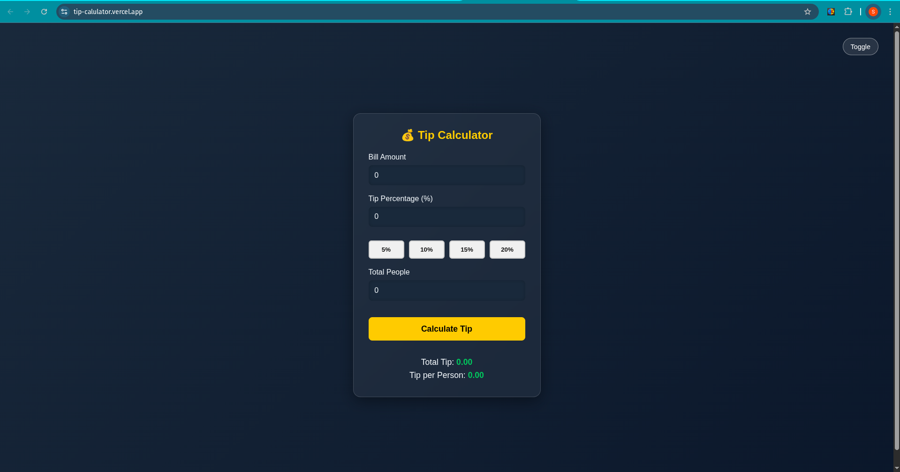
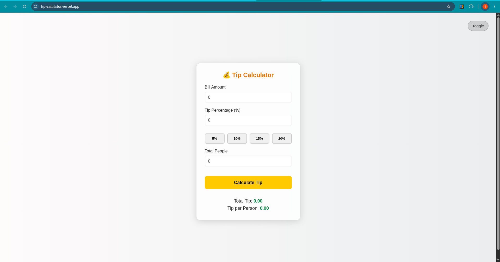

# 💰 Tip Calculator

A beautifully designed, responsive Tip Calculator built using **HTML**, **CSS**, and **JavaScript**. It lets users quickly calculate total tip and tip per person, with a sleek UI, light/dark mode toggle, and custom discount buttons.

## 🚀 Features

- 🎨 **Light/Dark Mode Toggle** — Switch themes on the fly with a smooth UI toggle.
- 🔢 **Instant Tip Calculation** — Calculates total tip and per person instantly.
- 💸 **Custom Tip Shortcuts** — Buttons for 5%, 10%, 15%, 20% to save time.
- 📱 **Responsive Design** — Works beautifully on all screen sizes.
- 💡 **User Input Validation** — Alerts users if inputs are invalid.

## 🖼️ UI Preview

📡 **Live Demo**: [https://tip-calulator.vercel.app/](https://tip-calulator.vercel.app/)

## 📁 File Structure

📦 Tip-Calculator
├── index.html # Main structure
├── style.css # All styling, themes, responsiveness
└── script.js # Core logic and interactivity

## 🧠 Tech Stack

- **HTML5** – Semantic layout
- **CSS3** – Responsive styles, custom themes, glassmorphism
- **JavaScript (Vanilla)** – Tip calculation logic, DOM interaction

## 📸 Highlights

- `data-action` attributes used for dynamic tip buttons
- `backdrop-filter: blur()` for glassy UI
- Theme toggle persists throughout session
- Clean color contrast in both modes
- Mobile-friendly button sizes and layout

## 📦 How to Run

1. Clone the repo:  git clone https://github.com/Saimahmed78/10-Days-10-JS-Projects-Series/tree/main/Tip-Calculator

2. Open `index.html` in your browser.
3. Start calculating tips like a boss 😎

## 📷 Screenshots

**Dark Mode**

**Light Mode**

## 🔮 Future Enhancements

- Store theme preference in `localStorage`
- Add a split bill feature with custom names
- Show a history of last calculated tips
- Add animation when switching themes

## 🙌 Created By

**Saim Ahmed** – _Future Software Engineer & UI Polisher Extraordinaire_
Let’s connect: [GitHub](https://github.com/Saimahmed78) • [LinkedIn](https://www.linkedin.com/in/saim-ahmed-722b802ba)

---

> _“A great UI isn’t just beautiful — it’s efficient, obvious, and invisible.”_
